# Flutter News Application

> Mytech Case Study - News App

## Demo

**[Ekran Kaydı İzle](YOUR_VIDEO_LINK_HERE)**

*Video linkini buraya ekleyin (YouTube, Google Drive, veya Loom)*

## Proje Hakkında

Bu proje, Mytech iş başvurusu kapsamında geliştirilmiş, production-ready bir haber ve sosyal medya uygulamasıdır. Modern Flutter development pratiklerini, clean architecture prensiplerini ve enterprise-level kod kalitesini sergiler.

### Temel Özellikler

**Kimlik Doğrulama Sistemi**
- JWT tabanlı güvenli authentication
- Email validasyonu ve şifre güvenlik kontrolleri
- Secure storage ile token yönetimi

**Kaynak Yönetimi**
- Dinamik kaynak arama ve filtreleme
- Çoklu kaynak seçimi
- Kalıcı kullanıcı tercihleri

**Haber Akışı**
- Kategori bazlı haber listeleme
- Haber Favorileme
- "Son Haberler" ve "Sana Özel" filtreleri

**Kategori Detay Sayfası**
- Infinite scroll pagination implementasyonu
- Kategori bazlı filtreleme
- Liste render optimizasyonu

**Twitter Entegrasyonu**
- Popüler tweet akışı
- Kişiselleştirilmiş tweet önerileri
- Infinite scroll pagination

**Cache Mekanizması**
- 1 saatlik Hive cache implementasyonu


### Bonus Özellikler

Proje gereksinimlerinin dışında aşağıdaki özellikler eklenmiştir:

**Tema Sistemi**
- Material Design 3 implementasyonu
- Light/Dark mode desteği
- Dinamik renk şemaları
- Kalıcı tema tercihi

**Çoklu Dil Desteği (i18n)**
- İngilizce ve Türkçe dil desteği
- easy_localization ile runtime dil değiştirme
- Tüm UI elementlerinde lokalizasyon

**Unit Testing**
- Unit testler (Services, Repositories)
- Mockito ile mock-based testing

**CI/CD Pipeline**
- GitHub Actions workflow
- Otomatik test execution
- Code quality checks


## Ekran Görüntüleri

### Dark Mode
<table>
  <tr>
    <td>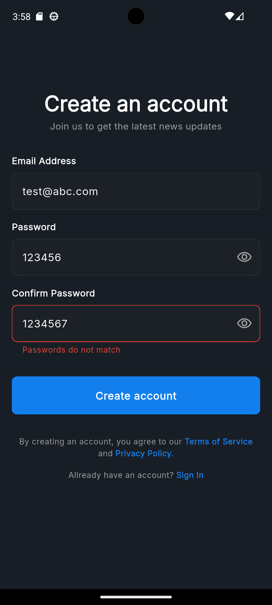</td>
    <td>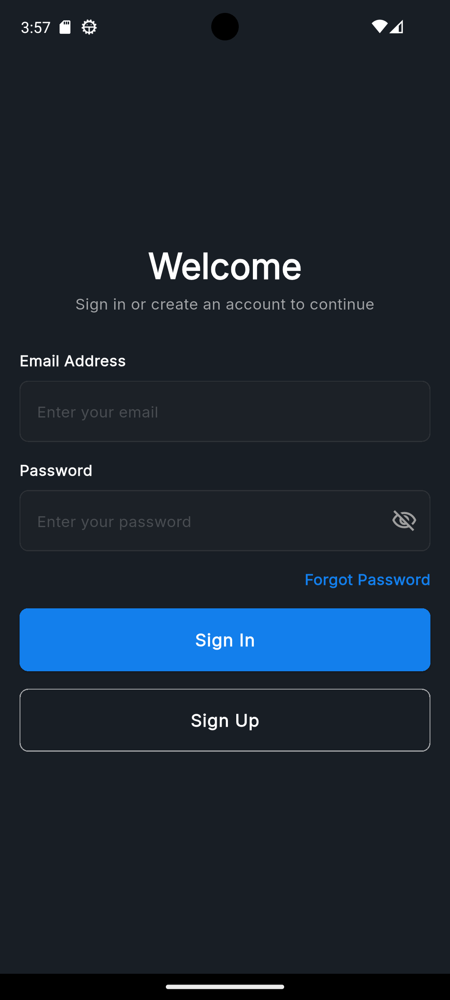</td>
    <td>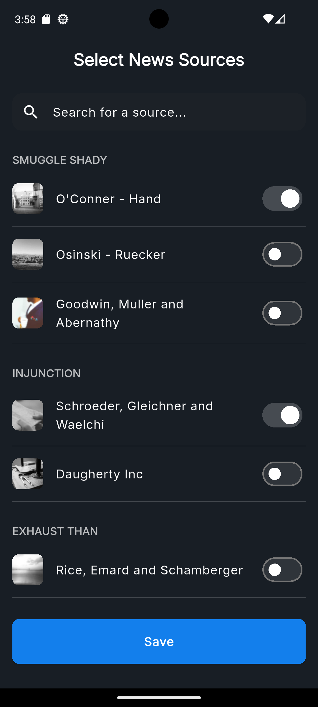</td>
    <td>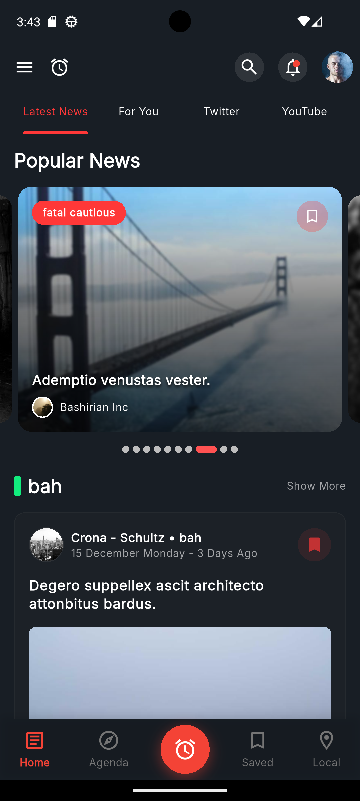</td>
  </tr>
  <tr>
    <td align="center">Giriş</td>
    <td align="center">Kayıt</td>
    <td align="center">Kaynak Seçimi</td>
    <td align="center">Ana Sayfa</td>
  </tr>
</table>

<table>
  <tr>
    <td>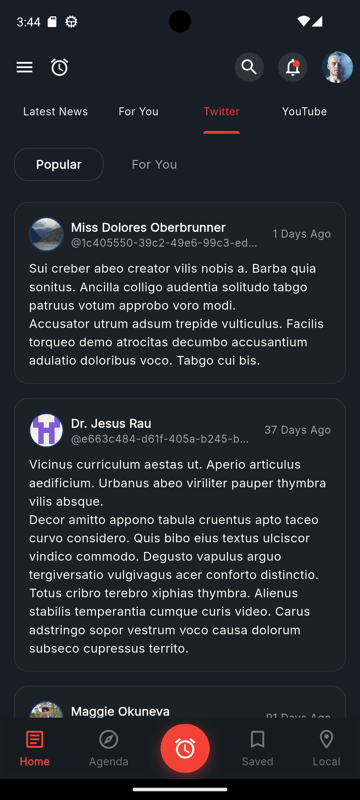</td>
    <td>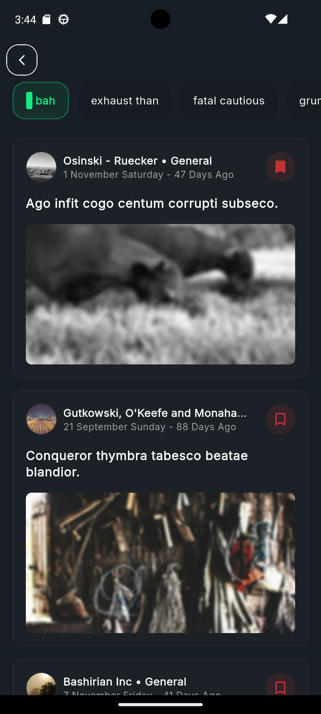</td>
    <td>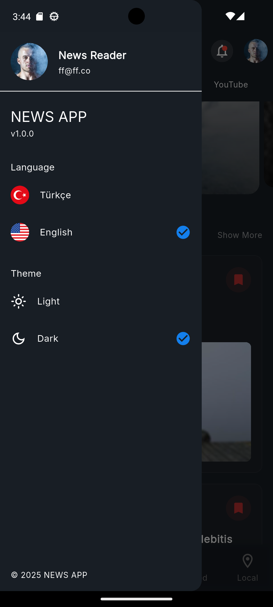</td>
  </tr>
  <tr>
    <td align="center">Kategori Detay</td>
    <td align="center">Twitter Akışı</td>
    <td align="center">Drawer</td>
  </tr>
</table>
### Light Mode
<table>
  <tr>
    <td>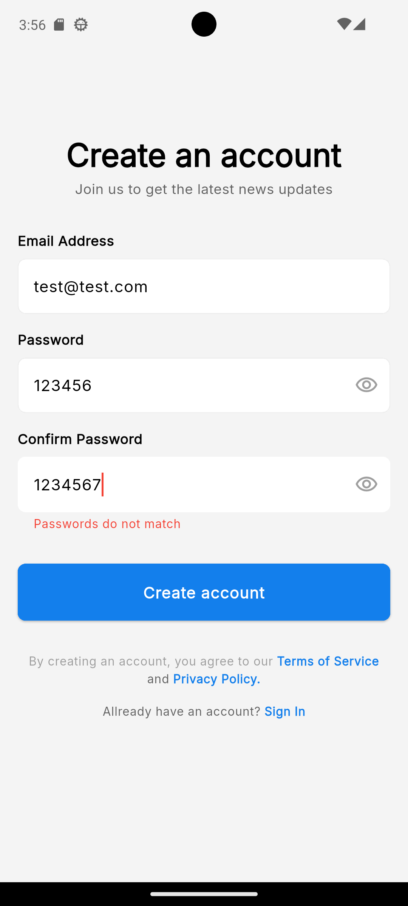</td>
    <td>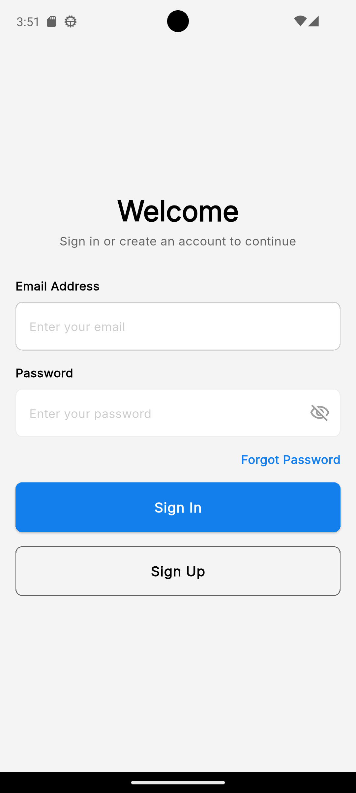</td>
    <td>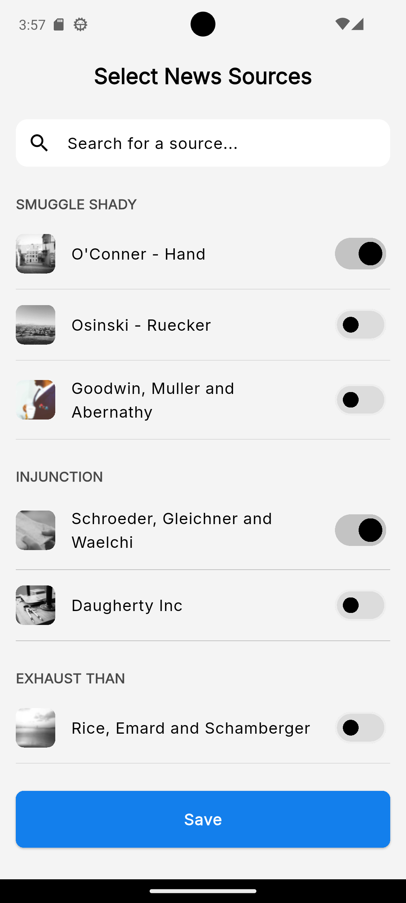</td>
    <td>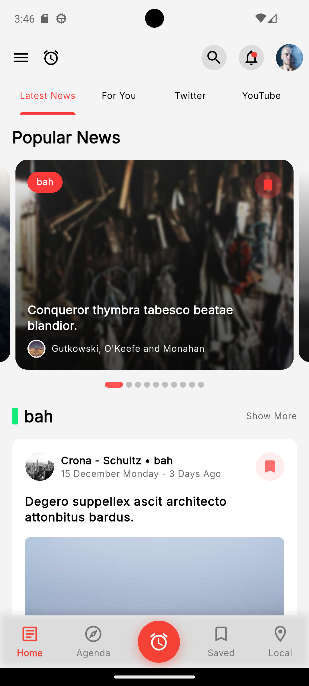</td>
  </tr>
  <tr>
    <td align="center">Giriş</td>
    <td align="center">Kayıt</td>
    <td align="center">Kaynak Seçimi</td>
    <td align="center">Ana Sayfa</td>
  </tr>
</table>

<table>
  <tr>
    <td></td>
    <td></td>
    <td>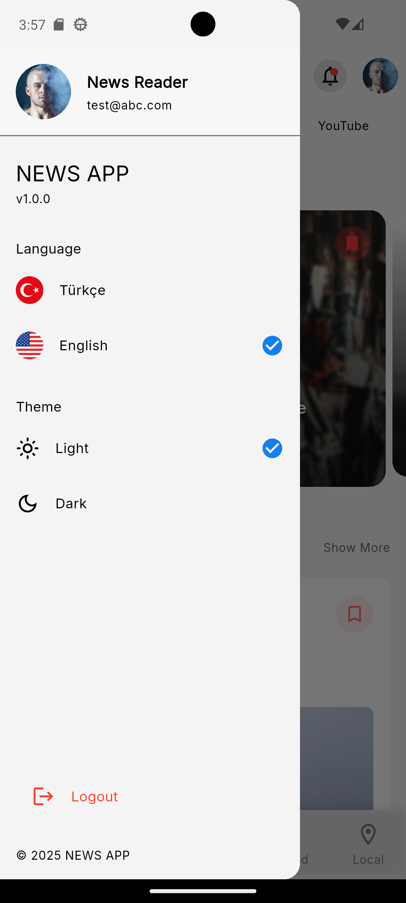</td>
  </tr>
  <tr>
    <td align="center">Kategori Detay</td>
    <td align="center">Twitter Akışı</td>
    <td align="center">Drawer</td>
  </tr>
</table>


## Mimari Yapı

### MVVM Pattern Implementation

Proje, MVVM (Model-View-ViewModel) mimarisi üzerine kurulmuştur. Bu yaklaşım, separation of concerns prensibini uygulayarak kodun test edilebilirliğini artırır.

```
lib/
├── app/
│   ├── common/              # Proje genelinde ortak kullanılan ui bileşenleri
│   │   ├── components/      # Snackbar, dialog gibi UI componentleri
│   │   ├── decorations/     # Input decoration'lar
│   │   ├── helpers/         # Date formatter, utility fonksiyonlar
│   │   └── widgets/         # Custom button, error widget, progress indicator
│   ├── config/
│   │   ├── localization/    # Dil dosyaları ve string constant'ları
│   │   ├── routes/          # GoRouter konfigürasyonu
│   │   └── theme/           # Tema yönetimi ve renk şemaları
│   └── data/
│       ├── data_source/
│       │   ├── local/       # Hive cache, secure storage
│       │   └── remote/      # API service implementasyonları
│       ├── model/           # JSON serializable data modeller
│       ├── repository/      # Repository pattern implementasyonları
├── core/
│   ├── connection/          # Network connectivity checker
│   ├── error/               # Custom exception ve failure sınıfları
│   ├── init/                # App initialization logic
│   ├── network/             # Dio configuration, interceptor'lar
│   └── utils/               # Validator'lar, extension'lar, enum'lar
└── feature/
    ├── auth/                # Authentication feature module
    │   ├── mixin/           # Login/Signup mixin'leri
    │   ├── view/            # UI screens
    │   ├── view_model/      # Auth state management
    │   └── widgets/         # Feature-specific widget'lar
    ├── category_news/       # Kategori detay feature
    ├── home/                # Ana sayfa feature
    ├── layout/              # App layout ve bottom navigation
    ├── profile/             # Kullanıcı profil yönetimi
    ├── sources/             # Kaynak seçimi feature
    ├── splash/              # Splash screen
    └── twitter/             # Twitter feed feature
```

### Katman Ayrımı ve Data Flow

```
┌─────────────────────────────────────────────────────────┐
│                 Presentation Layer                      │
│                  (Views & Widgets)                      │
│  - ConsumerWidget/StatefulWidget                        │
│  - UI rendering ve user interaction                     │
└────────────────────┬────────────────────────────────────┘
                     │ ref.watch() / ref.read()
                     ▼
┌─────────────────────────────────────────────────────────┐
│                   ViewModel Layer                       │
│              (Riverpod StateNotifiers)                  │
│  - State management                                     │
│  - Business logic orchestration                         │
│  - UI state transformation                              │
└────────────────────┬────────────────────────────────────┘
                     │ Repository calls
                     ▼
┌─────────────────────────────────────────────────────────┐
│                   Repository Layer                      │
│  - Business logic implementation                        │
│  - Data source coordination                             │
│  - Error handling ve transformation                     │
│  - Either<Failure, Success> pattern                     │
└────────────────────┬────────────────────────────────────┘
                     │ Service calls
                     ▼
┌─────────────────────────────────────────────────────────┐
│                  Data Source Layer                      │
│  - API communication (Dio)                              │
│  - Local storage (Hive, SharedPreferences)              │
│  - Secure storage (FlutterSecureStorage)                │
└────────────────────┬────────────────────────────────────┘
                     │
                     ▼
┌─────────────────────────────────────────────────────────┐
│                  External Services                      │
│  - REST API                                             │
│  - Local Database                                       │
│  - Cache Storage                                        │
└─────────────────────────────────────────────────────────┘
```


## Kurulum ve Çalıştırma

**1. Repository'yi klonlayın**
```bash
git clone https://github.com/YOUR_USERNAME/flutter_news_app.git
cd flutter_news_app
```

**2. Bağımlılıkları yükleyin**
```bash
flutter pub get
```

**3. Code generation çalıştırın**
```bash
flutter pub run build_runner build --delete-conflicting-outputs
```

**4. Environment variables ayarlayın**

Proje root dizininde `.env` dosyası oluşturun:
```env
API_KEY=test-api-key
```

**5. Uygulamayı çalıştırın**
```bash
flutter run
```

### Test Çalıştırma

```bash
# Tüm testleri çalıştır
flutter test
```


## API Konfigürasyonu

### Endpoint Yapısı

```
Base URL: https://interview.test.egundem.com/api/v1

Authentication:
- Header: x-api-key: test-api-key
- Bearer Token: Authorization: Bearer {jwt_token}

Endpoints:
├── /auth
│   ├── POST /register
│   └── POST /login
├── /users
│   └── GET /profile
├── /sources
│   └── GET /
├── /categories
│   └── GET /
├── /news
│   ├── GET /
│   ├── GET /by-category/:id
│   └── GET /categories-with-news
├── /saved-news
│   ├── POST /
│   └── DELETE /:id
└── /tweets
    └── GET /
```


